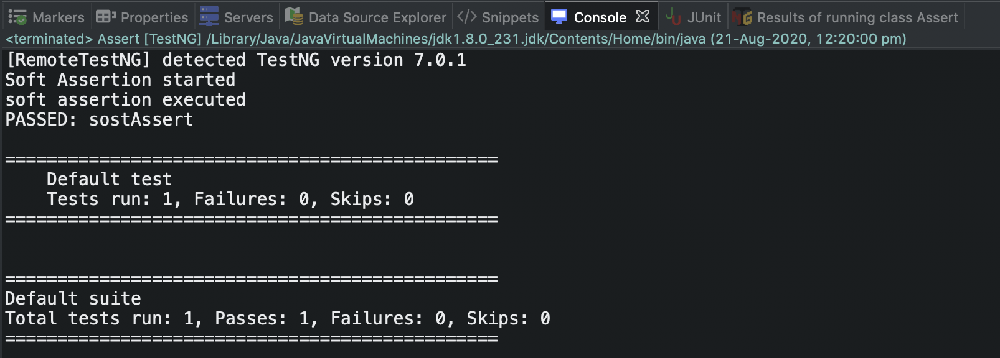
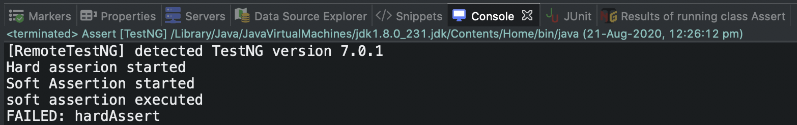
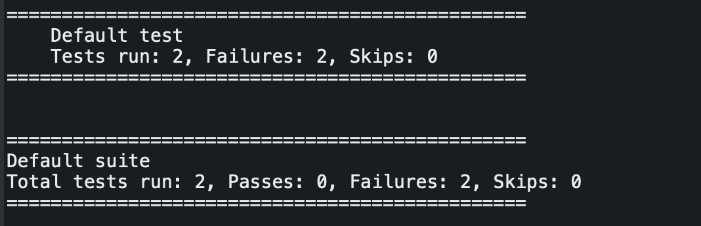

## Top 50 Selenium Interview Questions and Answers (Q#11-Q#20)

Previous posts of frequently asked Selenium interview questions and answers for freshers are [Q#1-Q#10](https://nishantranjan.in/50%20selenium%20questions%20%281-10%29/)

#### 11. How many parameters can selenium commands have at minimum?
* **Host**
* **Port Number**
* **Browser**
* **URL**

**Host:** It is the parameter which we use to bind Selenium to a specific IP. Usually, we run selenium tests on our local machine so the value will be ‘localhost’. You can sepcify IP address instead of localhost.
```
java -jar <selenium server standalone jar name> -host <Your IP Address>
```
**Port Number:** TCP/IP port which is used to connect selenium tests to the selenium grid hub. Default port hub is 4444.
java -jar <selenium server standalone jar name> -role hub -port 4444

Make sure no other application in your system is using this port. You may face an exception like Exception in thread “main” java.net.BindException: Selenium is already running on port 4444. Or some other service is.

If this occurs you can either shutdown the other process that is using port 4444, or you can tell Selenium-Grid to use a different port for its hub. Use the -port option for changing the port used by the hub.
```
java -jar <selenium server standalone jar name> -role hub -port 4441
```
**Browser:** To pass the browser which has to execute our selenium scripts

**URL:** To pass the application URL

#### 12. What are the Open-source Frameworks supported by Selenium WebDriver?
* **JUnit**
* **TestNG**

#### 13. What is the difference between “/” and “//” ?
**Single Slash “/”** – Single slash is used to create XPath with absolute path i.e. the XPath would be created to start selection from the document node/start node.

**Double Slash “//”** – Double slash is used to create XPath with relative path i.e. the XPath would be created to start selection from anywhere within the document.

#### 14. 38. What are Soft Assert and Hard Assert in Selenium?
**Soft Assert:** Soft Assertions are customized error handlers provided by TestNG. Soft Assertions do not throw exceptions when assertion fails, and they simply continue to the next test step. They are commonly used when we want to perform multiple assertions.

Example:
```
@Test
	public void softAssert() {
		SoftAssert softAssertion = new SoftAssert();
		System.out.println("Soft Assertion started");
		softAssertion.assertTrue(false);
		System.out.println("soft assertion executed");
	}
```
Output:


**Hard Assert:** Hard Assert throws an AssertException immediately when an assert statement fails and test suite continues with next @Test

Example:
```
@Test
	public void sostAssert() {
		SoftAssert softAssertion = new SoftAssert();
		System.out.println("Soft Assertion started");
		softAssertion.assertTrue(false);
		System.out.println("soft assertion executed");
		driver.manage().timeouts().implicitlyWait(2000, TimeUnit.MILLISECONDS);
	}

	@Test
	public void hardAssert() {
		System.out.println("Hard asserion started");
		org.testng.Assert.assertTrue(false);
		System.out.println("Hard asser executed");
	}
  ```
  Output:



#### 15. How to launch browsers without saving drivers in your local?
Using WebDriverManager, we can automatically download the driver’s binary files (.exe files) for Web Automation. 

**What is WebDriverManager in Selenium?**
* This is aimed at automating the WebDriver binaries management.
* It downloads the required Driver binary file (if not present locally) into Cache (default location ~/.m2/repository/webdriver).
* This eliminates the problem of locally storing the driver binary files and maintaining different versions of the driver files (for different browsers).
* Unless specified, downloads latest version of the binary (.exe file).

**How to set driver binary automatically using WebDriverManager?**
* First you need to add the dependency in **pom** file as below:-
```
<dependency>
			<groupId>io.github.bonigarcia</groupId>
			<artifactId>webdrivermanager</artifactId>
			<version>4.1.0</version>
			<scope>test</scope>
</dependency>
```
* Code example
```
public void WebDriverManagerTest()
    {
        //setup the chromedriver using WebDriverManager
        WebDriverManager.chromedriver().setup();
 
        //Create driver object for Chrome
        WebDriver driver = new ChromeDriver();
 
        //Navigate to a URL
        driver.get("https://toolsqa.com");
 
        //quit the browser
        driver.quit();
    }
```
#### 16. Is the FirefoxDriver a Class or an Interface?
FirefoxDriver is a Java class, and it implements the WebDriver interface.

#### 17. What are navigation commands in selenium?
* **driver.navigate().to**("https://www.nishantranjan.in/"); - Navigates to the provided URL

* **driver.navigate().refresh()**; - This method refreshes the current page

* **driver.navigate().forward();** - This method does the same operation as clicking on the Forward Button of any browser. It neither accepts nor returns anything.

* **driver.navigate().back();** - This method does the same operation as clicking on the Back Button of any browser. It neither accepts nor returns anything.

#### 18. What is the major difference between driver.close() and driver.quit()?
**driver.close()**: This command closes the browser’s current window. If multiple windows are open, the current window of focus will be closed.

**driver.quit()**: When quit() is called on the driver instance and there are one or more browser windows open, it closes all the open browser windows.

#### 19. How to scroll down a page using JavaScript?
* scrollBy() method is used to scroll down the webpage.

Syntax:
```
executeScript("window.scrollBy(x-pixels,y-pixels)");
```
* First, create a JavaScript object
```
JavascriptExecutor js = (JavascriptExecutor) driver;
```
* Launch the desired application
```
driver.get(“https://www.nishant.in”);
```
* Scroll down to the desired location
```
js.executeScript("window.scrollBy(0,1000)"); 
```
The window is not scrolled vertically by 1000 pixels

#### 20. How to retrieve CSS properties of an element?
* getCssValue() method is used to retrieve CSS properties of any web element

General Syntax:
```
  driver.findElement(By.id(“id“)).getCssValue(“name of css attribute”);
```
Example:
```
   driver.findElement(By.id(“email“)).getCssValue(“font-size”);
```