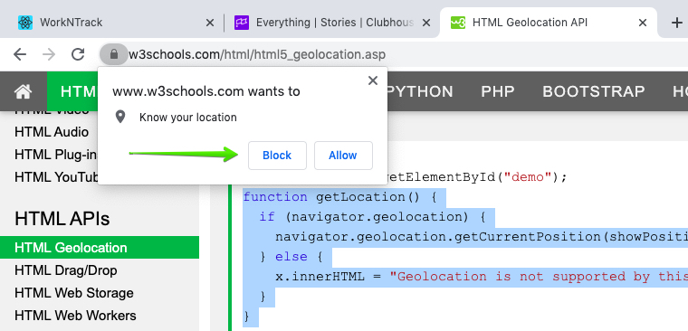

## Top 50 Selenium Interview Questions and Answers (Q#31-Q#40)


Previous posts of frequently asked Selenium interview questions and answers for freshers are [Q#1-Q#10](https://nishantranjan.in/50%20selenium%20questions%20%281-10%29/), [Q#11-Q#20](https://nishantranjan.in/50%20selenium%20questions%20(11-20)/), [Q#21-Q#30](https://nishantranjan.in/50%20selenium%20questions%20(21-30)/)

#### 31. Mention types of data you have handled in Selenium?
* Excel
* CSV
* XML
* JSON
* YAML
* SQL

#### 32. How to handle browser (chrome) notifications in Selenium?
In Chrome, we can use ChromeOptions as shown below.



```
ChromeOptions options = new ChromeOptions();
options.addArguments("disable-infobars");
WebDriver player = new ChromeDriver(options);
```

#### 33. What is the use of @Listener annotation in TestNG?
TestNG listeners are used to configure reports and logging. One of the most widely used listeners in TestNG is ITestListener interface. It has methods like onTestStart, onTestSuccess, onTestFailure, onTestSkipped etc. We should implement this interface creating a listener class of our own. Next, we should add the listeners annotation (@Listeners) in the Class which was created.

#### 34. What is TestNG Assert and list out some common Assertions supported by TestNG?
TestNG Asserts help us to verify the condition of the test in the middle of the test run. Based on the TestNG Assertions, we will consider a successful test only if it is completed the test run without throwing any exception.

Some of the common assertions supported by TestNG are

* assertEqual(String actual,String expected)
* assertEqual(String actual,String expected, String message)
* assertEquals(boolean actual,boolean expected)
* assertTrue(condition)
* assertTrue(condition, message)
* assertFalse(condition)
* assertFalse(condition, message)

#### 35. What are the annotations available in TestNG?
* @BeforeTest
* @AfterTest
* @BeforeClass
* @AfterClass
* @BeforeMethod
* @AfterMethod
* @BeforeSuite
* @AfterSuite
* @BeforeGroups
* @AfterGroups
* @Test

#### 36. How to delete Browser Cookies with Selenium Web Driver?
```
driver.Manage().Cookies.DeleteAllCookies();
```

#### 37. What is desired capabilities?
In Selenium we use desired capabilities to handle SSL certificates in chrome browser

We need to create an instance of DesiredCapabilities

```
DesiredCapabilities desiredCapability = DesiredCapabilities.chrome();
```

#### 38. How To Perform Double Click Action In Selenium WebDriver?
Using Actions class to do Double click action in selenium.

Example:

```
package softwareTestingMaterial;

import org.openqa.selenium.By;
import org.openqa.selenium.JavascriptExecutor;
import org.openqa.selenium.WebDriver;
import org.openqa.selenium.WebElement;
import org.openqa.selenium.chrome.ChromeDriver;
import org.openqa.selenium.interactions.Actions;
import org.testng.annotations.Test;

public class ActionsClass {
	
	@Test
	public void doubleClick() throws InterruptedException{
		System.setProperty("webdriver.chrome.driver", "D:\\Selenium Environment\\Drivers\\chromedriver.exe");
		WebDriver driver = new ChromeDriver();
                //Open the required URL where you could do double click action
		driver.get("http://api.jquery.com/dblclick/");
                //Maximize the browser
                driver.manage().window().maximize();
                //As per the above URL we need to switch to frame. The targeted element is in the frame
		driver.switchTo().frame(0);
                //Create the object 'action'		
		Actions action = new Actions(driver);
		//Find the targeted element
		WebElement ele = driver.findElement(By.cssSelector("html>body>div"));
                //Here I used JavascriptExecutor interface to scroll down to the targeted element
		((JavascriptExecutor) driver).executeScript("arguments[0].scrollIntoView();", ele);
                //used doubleClick(element) method to do double click action
		action.doubleClick(ele).build().perform();
                //Once clicked on the element, the color of element is changed to yellow color from blue color
                //driver.close();
	}
}
```

#### 39. How to connect a Database in selenium?
As we all know Selenium WebDriver is a tool to automate User Interface. We could only interact with Browser using Selenium WebDriver.

We use JDBC Driver to connect the Database in Selenium (While using Java Programming Language).

#### 40. How to switch between frames in Selenium?
```
driver.switchTo().frame();
```