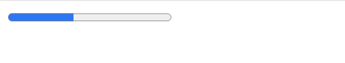
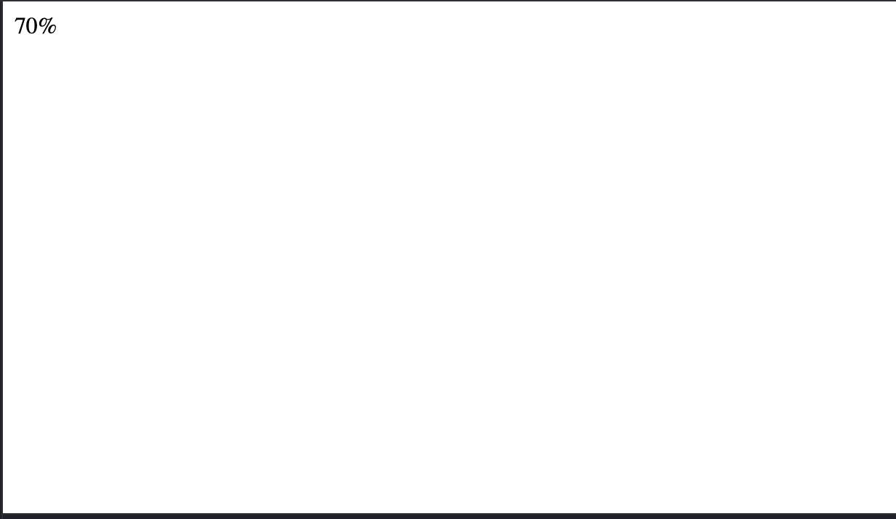
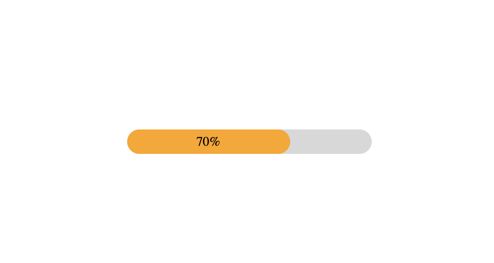
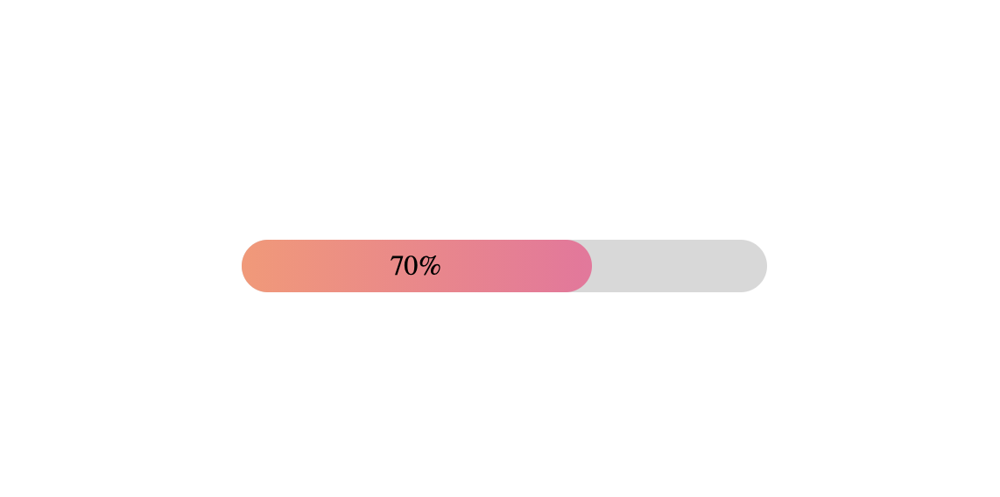

We can create a progress bar using `progress tag` in HTML. Also, we can create a custom progress bar using javascript. Please read this post till the end, you will learn how to create a custom progress bar.

**Using progress tag:**

```
<progress value='40', max='100'>nishant</progress>
```
Output:



You can practice here: [Progress bar example](https://www.w3schools.com/code/tryit.asp?filename=GM85HH0WKV0F)


 **Now let's build a progress bar using HTML and CSS.**

Follow these stpes to start:

* Create an html file (ex:index.html)
* Create a css file (ex: style.css)
* Create a js file (ex: main.js)


index.html
```
<html>
  <div class='progress'>
    <div class='progress-done' data-done='70'>
      70%
    </div>
  </div>
</html>
```

In the above example as you can see I have created to div tag and assigned 2 classes.

Output:



style.css
```
body {
  display: flex;
  align-items: center;
  justify-content: center;
  height: 100vh;
  margin: 0;
}

.progress {
  background-color: #d8d8d8;
  border-radius: 30px;
  height: 30px;
  width: 300px;
}

.progress-done {
  background-color: orange;
  border-radius: 20px;
  display: flex;
  align-items: center;
  justify-content: center;
  height: 100%;
  width: 200px;

}
```
Here we have created a `CSS` file to style the progress bar.

Output:



Let's style it more and play with the linear-gradient. In `.progress-done` class, change the background color.

```
.progress-done {
  background: linear-gradient(to left, #F2709C, #FF9472);
  border-radius: 20px;
  display: flex;
  align-items: center;
  justify-content: center;
  height: 100%;
  width: 200px;

}
```
output:




**Now let's use javascript to update the progress bar**

For this we will make small changes in all 3 files as follows:

index.html

Let's create a button which we will be using to start the progress bar.
```
<html>
  <header>
  </header>
  <div class='progress'>
    <div class='progress-done' data-done='70'>

    </div>
  </div>
  <button class='button' onClick='upload()'>
    Upload
  </button>

</html>

```

main.js

Create a function with will trigger the progress bar.

```
const upload = () => {
  const progressBar = document.querySelector('.progress-done')
  progressBar.setAttribute('id', 'play-animation')
}
```

style.css

In this file(CSS) we have imported `keyframes` for some animation.
```
body {
  display: flex;
  align-items: center;
  justify-content: center;
  height: 100vh;
  margin: 0;
}

.progress {
  background-color: #d8d8d8;
  border-radius: 30px;
  height: 30px;
  width: 300px;
}

.progress-done {
  box-shadow: 0 3px 3px -5px, 0 2px 5px;
  border-radius: 30px;
  height: 100%;
}

#play-animation {
  background: green;
  animation: progress-animation 5s forwards;
}

.button {
  background-color: grey;
  border-radius: 30px;
  padding: 6px;
}

@keyframes progress-animation {
  0% {
    width: 0%;
  }

  100% {
    width: 70%;
  }
}
```

Now, once the page will be loaded progress bar will not be updated until the user clicks on the upload button.

Output:

<iframe width="100%" height="300" src="//jsfiddle.net/nishu2811/jtpg83vy/156/embedded/" allowfullscreen="allowfullscreen" allowpaymentrequest frameborder="0"></iframe>

**Thanks for reading. Happy new Year. :)**