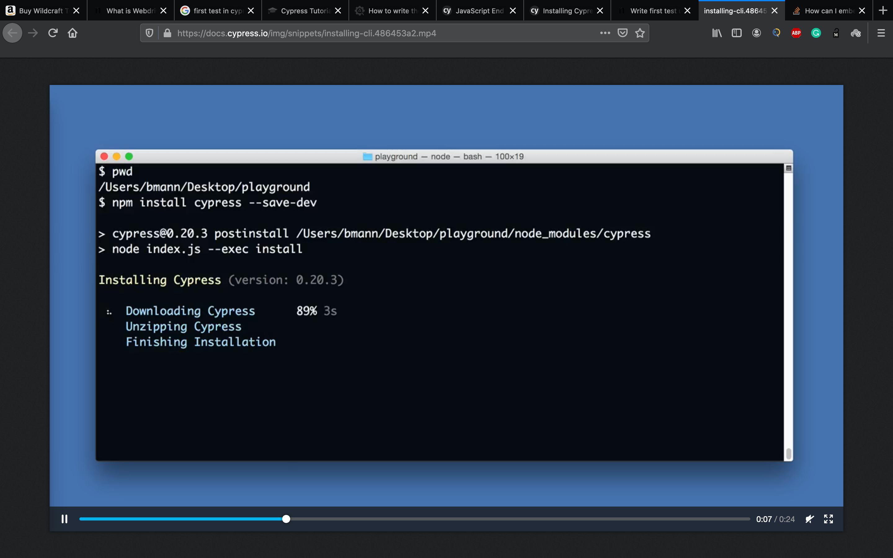
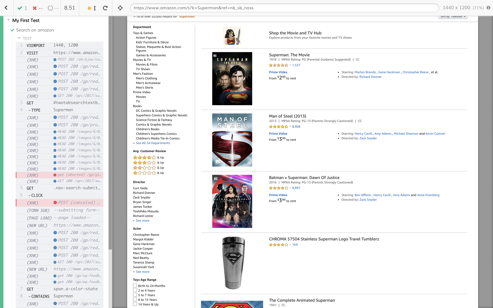
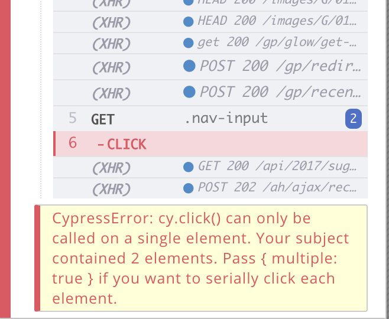

## Introduction
Cypress is a next-generation automation testing tool built for the modern web application. The most important part of it, it doesn’t build on Selenium WebDriver. Cypress is fundamentally and architecturally different than Selenium.

Cypress tests are implemented on Mocha and Chai. Its syntax will be familiar to Javascript users. This means that if you have ever worked with Javascript, it will be especially easy to start using Cypress.

Selenium is made up of bindings, or libraries, and the WebDriver. All those components help test engineers when controlling the browsers. These two components work through the JSON network. But Cypress uses its own DOM manipulation strategy. There’s no network communication or what so ever.

## Install Cypress
* Create a folder 'XYZ'
* Open Terminal/command line
* Run these commands:- 

```
cd /your/project/path
``` 
```
npm install cypress --save-dev
```
or
```
yarn add cypress --dev
```
Click to Play this video:- 

[](https://docs.cypress.io/img/snippets/installing-cli.486453a2.mp4)

## Cypress Opening
If you used npm to install, Cypress has now been installed to your ./node_modules directory, with its binary executable accessible from ./node_modules/.bin.

```
./node_modules/.bin/cypress open
```

or
```
npx cypress open
```

Or by using `yarn`
```
yarn run cypress open
```

## Implement First Test Cases
You need to browse to your cypress installation folder and create a javascript file. After that, you will be able to see newly created javascript file in Cypress IDE.


Then open your js file with your favorite editor to edit it.Then copy paste this code snippet in your js file.

```
describe('My First Test', function() {
  it('Search on amazon', function() {
    cy.viewport(1440,1200)
    cy.visit('https://www.amazon.com/')
    cy.get('#twotabsearchtextbox').type('Superman')
    cy.get('.nav-search-submit .nav-input').click()
    cy.get('span.a-color-state').contains('Superman')
  })
})
```

As you can see, there is a cy object that we always use. Cy object allows you to interact with the browser. It should be used before every command. Let’s take a look at what the code does.

* **cy.viewport(HEIGHT, WIDTH):** This command changes the screen size according to the value that you provide
* **cy.visit(‘URL’):** This method is the navigation method for Cypress. It calls the given URL
* **cy.get(‘locator’):** This method takes an argument which is the CSS locator of the web element that we want to interact.
* **cy.get(‘locator’).type(‘INPUT’):** This method allows you to fill the input fields.
* **cy.get(‘locator’).click():** This method allows you to click a clickable object.
* **cy.get(‘locator’).contains(‘EXPECTED_VALUE’):** This method makes an assertion to the web element that you specified.

## Execute Test
You just need to open Cypress UI and click the desired test. It will start a Chrome instance. This chrome instance has 2 parts. On left-hand side, there’s a viewport for executed commands, on right hand side, there’s the preview part.



In case there’s an error. Cypress will warn you about the issue on command viewport.

Lets’ change the code and run the test once again.

```
describe('My First Test', function() {
  it('Search on amazon', function() {
    cy.viewport(1440,1200)
    cy.visit('https://www.amazon.com/')
    cy.get('#twotabsearchtextbox').type('Superman')
    cy.get('.nav-input').click()
    cy.get('span.a-color-state').contains('Superman')
  })
})
```
This test is going to fail because there are two elements with selector .nav-input. So Cypress will warn you about it.



Please share your thoughts on this in below comment box.