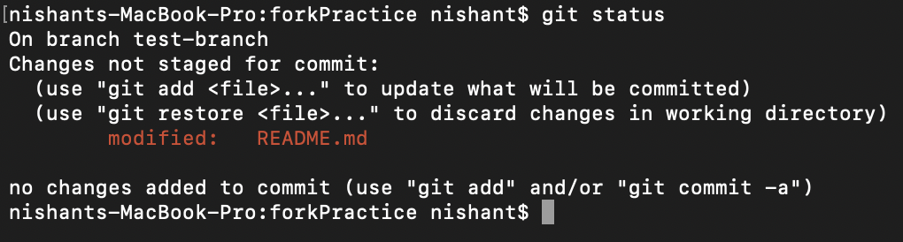
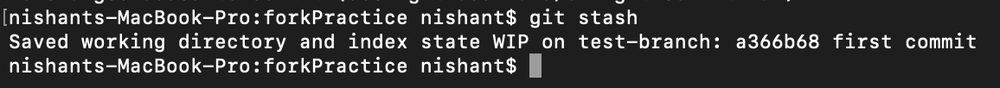
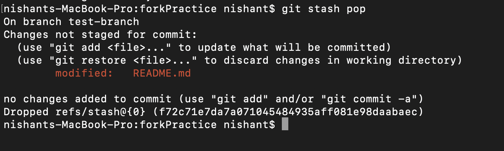

## Git Stash
Sometimes you want to switch the branches, but you are working on an incomplete part of your current project. You don't want to make a commit of half-done work. Git stashing allows you to do so. The git stash command enables you to switch branches without committing the current branch

The below image demonstrates the properties and role of stashing concerning repository and working directory.

#### Lets Understand how stashing works:
I have made changes to my project [repository](https://github.com/nishant-ranjan28/forkPractice) in readme file from two distinct [branches](https://nishantranjan.in/create%20first%20PR/#create-a-branch). I am in a messy state, and I have not entirely edited any file yet. So I want to save it temporarily for future use. We can stash it to save as its current status. To stash, let's have a look at the repository's current status. To check the current status of the repository, run the ***git status*** command. The git status command is used as:

    git status
Output:\

you can see the status that there are two untracked file **[readme.md](https://github.com/nishant-ranjan28/forkPractice/blob/master/README.md)** available in the repository. To save it temporarily, we can use the git stash command. The git stash command is used as:

    git stash
Output:\

## Git Stash Pop (Reapplying Stashed Changes)

Git allows the user to re-apply the previous commits by using ***git stash pop*** command. The popping option removes the changes from stash and applies them to your working file.

The git stash pop command is quite similar to git stash apply. The main difference between both of these commands is stash pop command that deletes the stash from the stack after it is applied.

    git stash pop
output:\

If you have some better tricks to use git stash, please share your ideas in comment section.