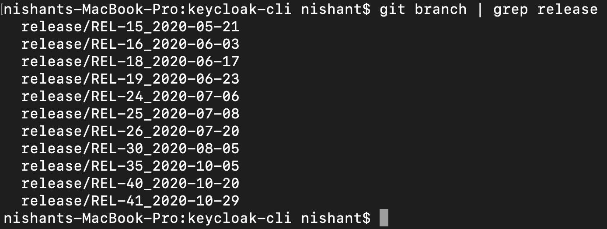
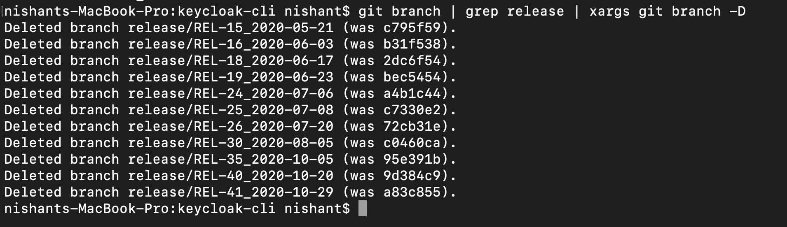

To delete many branches based on a specified pattern do the following:
Open the terminal, or equivalent.

Type in `git branch | grep <pattern>` for a preview of the branches that will be deleted.

Type in `git branch | grep <pattern> | xargs git branch -D`

Replace the `<pattern>` with a regular expression to match your branch names and that’s it.

**Thanks for reading :)**

