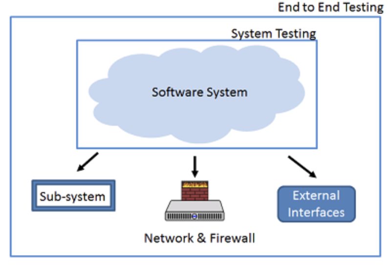

### What is E2E (End to End) testing?
End-to-end testing (e2e testing) is a software quality assurance methodology that ensures the correct functioning and performance of applications in production-like scenarios. This methodology checks if an application performs as designed on all levels and across all subsystems. The scope of end-to-end testing encompasses the application in its entirety, as well as its integration with external interfaces and outside applications.

### End to End testing tools
* Selenium (Java)
* WebDriverIO (Javascript)
* Cypress (Javascript) - Recommended

### Why End to End testing?
End-to-end testing is where you test your whole application from start to finish. It involves assuring that all the integrated pieces of an application function and work together as expected.

End-to-end tests simulate real user scenarios, essentially testing how a real user would use the application.

**These major risks can be avoided and can be controlled by E2E testing:**

- Keep a check and perform system flow verification.
- Increase the test coverage areas of all the subsystems involved with the software system.
- Detects issues, if any with the subsystems and thus increases the productivity of the whole software system.

**Example of an E2E test case for a user sign up.**

The test would involve:

- opening Merchant website in a browser and searching for certain elements
- performing a set of clicks and keyboard types
- ensuring that a user is successfully created

### E2E testing Framework

* **User Functions: Following actions should be performed as a part of building User Functions:**

Listing features of the software systems and their interconnected sub-systems.
For any function, keep track of the actions performed as well as Input and Output data.
Find the relations, if any between different Users functions.
Find out the nature of different user functions .i.e. if they are independent or are reusable.

* **Conditions: Following activities should be performed as a part of building conditions based on user functions:**

For each user function, a set of conditions should be prepared.
Timing, Data conditions, and other factors that affect user functions can be considered as parameters.

* **Test Cases: Following factors should be considered for building test cases:**

For every scenario, one or more test cases should be created to test each functionality of the user functions.
Every single condition should be enlisted as a separate test case.

#### End to End Testing Design framework consists of three parts

* Build user functions
* Build Conditions
* Build Test Cases

### How to do End to End testing?

* Requirements:

  a. Documentation and requirements gathering

* E2E Design

  a. Design of components

  b. e2e design

* Components Design

  a. Components design and testing

* Developments

  a. Development coding and design

* E2E Testing

  a. Environment set up for e2e testing (Including test data)

  b. Test design and execution

### End to End Testing Vs System Testing

| **End to End Testing** | **System Testing** |
|--|--|
| Validates both the main Software system as well as all the interconnected Sub-Systems. | Validates just the software system as per the requirements specifications. |
| It checks the complete end-to-end process flow. | It checks system functionalities and features. |
| All interfaces, backend systems will be considered for testing | Functional and Non-Functional Testing will be considered for testing |
| It's executed once System Testing is completed. | It's executed after Integration Testing. |

### What Not to Do When Writing E2E Tests?
* Don’t Write Them Without Defining the Reason
* Don’t Duplicate Coverage
* Don’t Use a Single-Layer Architecture
* Don’t Use Breakable Selectors
* Don’t Expect Your Suite to Be Maintenance-Free
* Don’t Ignore Flaky Tests

**_And Now the most Important_**

### How to write a great E2E test?

* Every test has to be independent. There’s no concession to that.
* Minimise your DB interactions, unless required.
* Randomise your data, do not rely on external data sources.
* E2E takes precedence over the contract, push it to unit or integration layer
* Remember even if we stop working for the team; our tests will; fix a failing test before writing a new one.
* Always think in Objects; minimize the use of primitives as parameters.
* Don’t rush into writing a test; Think <=> Design <=> Execute
* Always remember that our tests will eventually run-in CI, keep in mind any local references.
* Our tests should emulate real-user behavior and identify the business impact of failure; Remember our tests are first users.
* Make tests readable, remember we write code for others.
