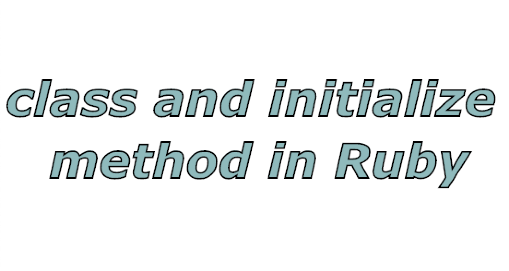

## Class in Ruby
Ruby is a perfect Object Oriented Programming Language. The features of the object-oriented programming language include −

-   Data Encapsulation
-   Data Abstraction
-   Polymorphism
-   Inheritance

> **Objects are the products of the class**.
An object is an individual “thing”, with its own identity & its own data.

Example:
A  `Book`  class could be the blueprint for creating books. This class defines what attributes ALL books have in common, like: `title`, `author`, `pages`

Code Example:

    class  Book
	    attr_accessor  :title, :author, :pages
	end
	
**Creating Objects using the “new” method in Ruby:**

Classes and objects are the most important part of Ruby. Like class objects are also easy to create, we can create a number of objects from a single class. In Ruby, objects are created by the new method.

Syntax:

    object_name = Class_name.new

	book1 = Book.new()
    book2 = Book.new()
    book3 = Book.new()

**Important Note:**
 - Class names start with an uppercase letter
 - We use the class keyword, then the end keyword
 - An empty class is not very useful, but you can still create objects from it

In above code example, `book1` is an object of Book class.
Every individual book is an object & we can make many of them thanks to the `Book` class.

Let's initialize some value in `book1`:

    book1.title = "Harry Potter"
    book1.author = "JK Rowling"
    book1.pages = 400

    book1.title = "Lord of the rings"
    book1.author = "Tolkien"
    book1.pages = 500

    puts book1.title
    puts book2.author
    
Run the above codes:

    Outputs:
    Harry Potter
    Tolkien

## Passing Parameters to new Method:

User can pass any numbers of parameters to “new method” which are used to initialize the class variables. While passing parameters to “new method” it is must to declare an initialize method at the time of class creation. The initialize method is a specific method, which executes when the new method is called with parameters.

Code Example:

    class  Book
	    attr_accessor  :title, :author, :pages
        def initialize(title, author, pages)
            @title = title
            @author = author
            @pages = pages
        end
	end

    book1 = Book.new("Harry Potter", "JK Rowling", 400)
    book2 = Book.new("Lord of the Ring", "Tolkein", 500)

    puts book1.title
    puts book2.author

Run the above codes:

    Outputs:
    Harry Potter
    Tolkien

**Explanations:**

 Here `Book` is the class name. **def** is a keyword which is used to define **“initialize”** method in Ruby. It is called whenever a new object is created. Whenever new class method called it always call _initialize_ instance method. **initialize** method is like a constructor, whenever new objects are created _initialize method_ called. _title, author, pages,_ are the parameters in initialize method and _@title @author, @pages_ are the local variables in initialize method with the help of these local variables we passed the value along the new method. The parameters in “new” method is always enclosed in double quotes.

 Please share your thoughts and suggestions below in comment section.