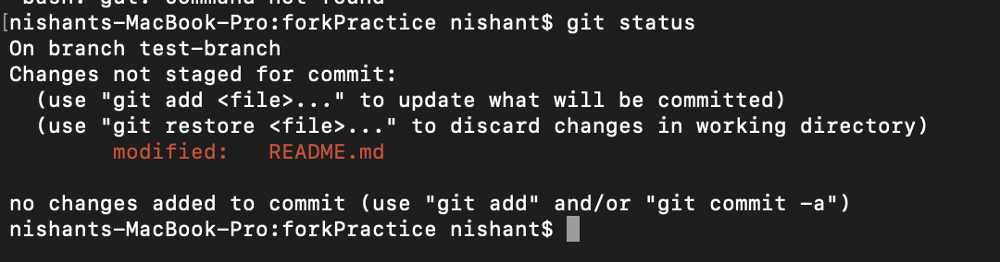
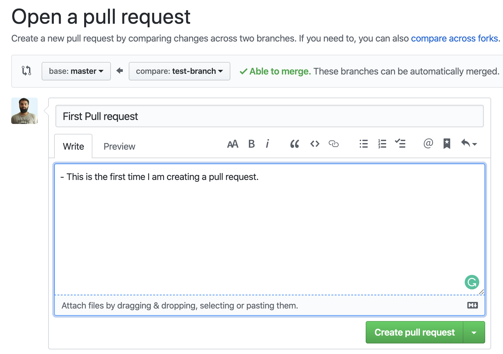

## What is forking?

When we love someone’s repository and would like to have it in our GitHub account, we fork it so that we can work with it separately.

When we fork a repository, we get an instance of that entire repository with its whole history. After forking, we can do whatever we want to do without affecting the original version.

## What is a pull request?

Pull requests are the way we contribute to group projects or open source projects.

*PR* let you tell others about changes you've pushed to a branch in a repository on GitHub. Once a pull request is opened, you can discuss and review the potential changes with collaborators and add follow-up commits before your changes are merged into the base branch.

## What it means to contribute?
Not only can we contribute to an open source project with code, but we can also contribute in many other ways.  Some othe ways lists are below

- Design
- Documentation
- Answering questions (Q&A)
- Project management (monitoring duplicate issues, suggest labels etc.)

## Lets Craete our first Pull request
1. Go to this repo: [Fork it](https://github.com/nishant-ranjan28/forkPractice)

Click on fork logo.
2. Next go to your account and check in repository section. (forked repo will be present)
3. Clone this repo

Open terminal or commant prompt and Type `git clone <repo url>`

4. Now we have set up a copy of the master branch from the main online project
	repository.
	We need to go to that cloned directory by running this command:
	`cd <name of the repo>`

## Create a branch
It's very important and real good practice to create branch while working with repositories. whether it’s a small project or contributing to a group's work.

Lets create a branch using `git checkout` command.
`git checkout -b <branch name>`

Now make some changes in existing file. We have readme file where we are going to make chnages and see how it works.

Here you can see I added one new line in readme file. Go to terminal/command prompt now.

Type command: `git status`

 

Now add the changes and commit it.\
To add command is `git add .`\
To commit command is `git commit -m "commit details"`

As we can see the remote name of this repo is `origin`. After knowing remote now we can push our chnages easily. 

Type this command to push the chnages: `git push origin <branch name>`

Here we can create our Pull request in two ways.
1. You can a see a URL to create your pull request. (In your terminal/command prompt screen)
2. Go to your repository on GitHub and you’ll see a button “Compare & pull request” and click it.

Please provide necessary details on what you’ve done (You can reference issues using “#”). Now submit the pull request.

Congratulations! You've made your first pull request.

If your pull request will be approved and merged in master branch, you will receive a mail as confirmation. 

We will discuss more about and git and git hub in upcoming posts. 

Share this post if you find this helpful.