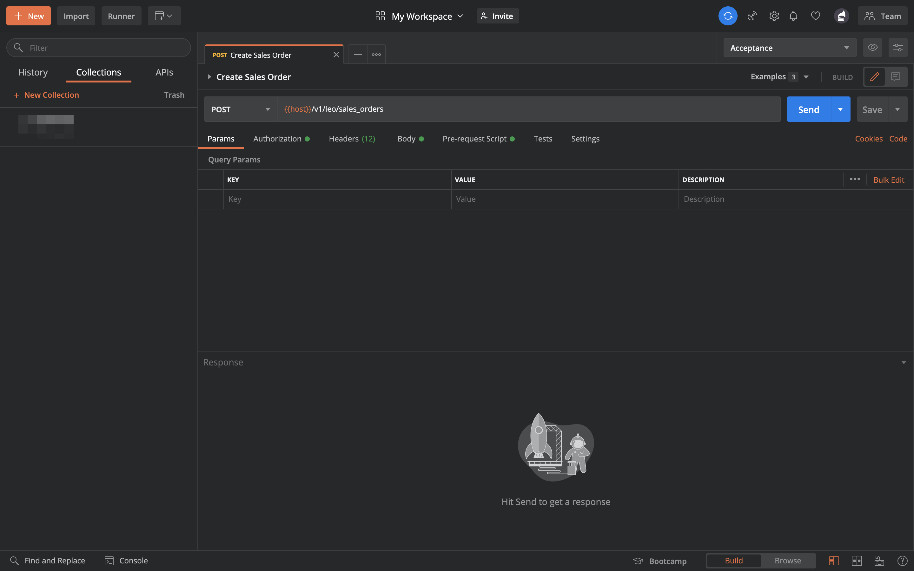
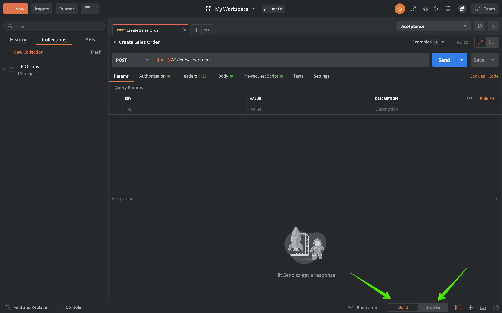
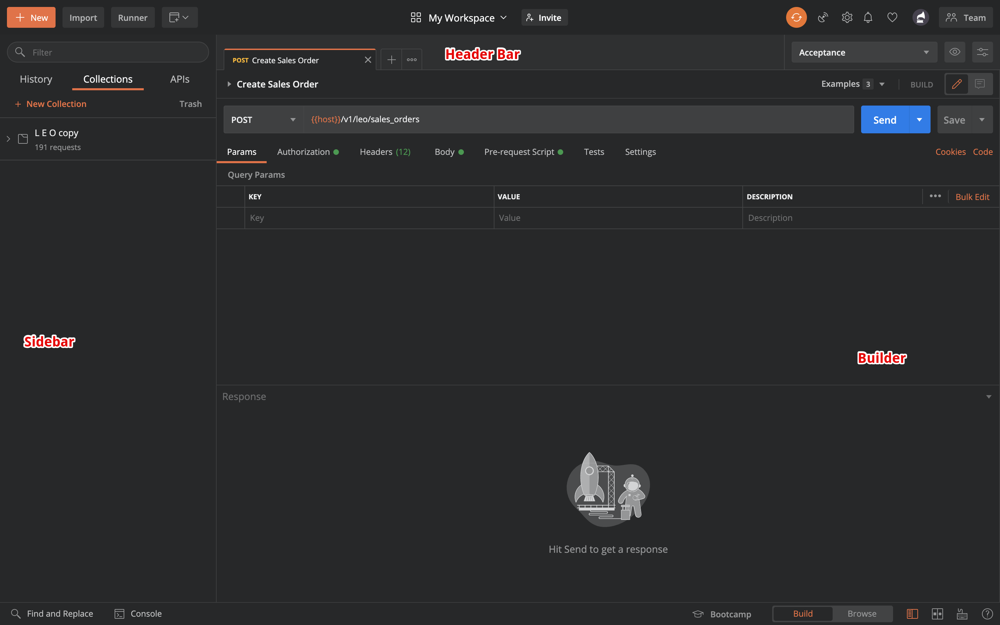
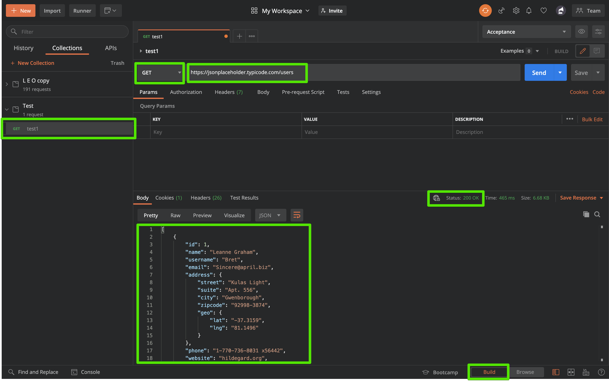

Before we dive into postman, let's discuss quickly API.

### What is API (Application Programming Interface)?
>An API is a set of programming code that enables data transmission between one software product and another. It also contains the terms of this data exchange.

### What is Postman?
**Postman is a standalone tool that exercises web APIs by making HTTP requests from outside the service.**

### Why Postman?

* **Accessibility** - To use the Postman tool, one would just need to log-in to their own accounts making it easy to access files anytime, anywhere as long as a Postman application is installed on the computer.
* **Use of Collections** - Postman lets users create collections for their Postman API calls. Each collection can create subfolders and multiple requests. This helps in organizing your test suites.
* **Collaboration** - Collections and environments can be imported or exported making it easy to share files. A direct link can also be used to share collections.
* **Creating Environments** - Having multiple environments aids in less repetition of tests as one can use the same collection but for a different environment. This is where parameterization will take place which we will discuss in further lessons.
* **Creation of Tests** - Test checkpoints such as verifying for successful HTTP response status can be added to each Postman API call which helps ensure test coverage.
* **Automation Testing** - Through the use of the Collection Runner or Newman, tests can be run in multiple iterations saving time for repetitive tests.
* **Debugging** - Postman console helps to check what data has been retrieved making it easy to debug tests.
Continuous Integration - With its ability to support continuous integration, development practices are maintained.

### Setup/Installation:
Follow the below-mentioned steps:

* Navigate to this link: https://www.postman.com/downloads/
* Download and install it.
* Sign up or Sign in
* Select/create a workspace
* Setup will look like this

* You can toggle Postman between two main modes: **Build** and **Browse** using the control at the bottom-right of the app, or the top-left on the web. The **Build** mode is the primary interface for working with API requests.

* Layouts

 a. The left sidebar provides access to your request history, collections, and APIs.

 b. The header allows you to create and import requests and collections, to access the Collection Runner, to move and invite collaborators to workspaces, to access the Interceptor, view sync status/notifications, open your Settings, account, and Postman plan.

 ### Send GET request
Get requests are used to retrieve information from the given URL. There will be no changes done to the endpoint.

Endpoint URL:
```
https://jsonplaceholder.typicode.com/users
```


In the next post, we will discuss post requests, Thanks for reading.