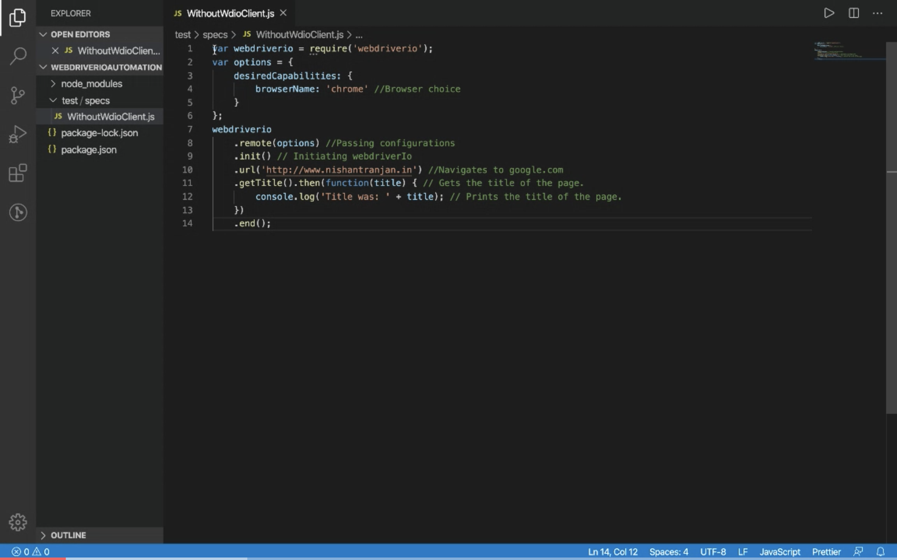

#### How to Install:
WebdriverIO is a ‘npm’ package and runs on ‘Node.js‘. So, we need to install ‘Node.js’ and ‘npm’ in our machine before installing WebdriverIO.

[Step by step process of installing ‘Node.js’ and ‘npm’ in our Windows / Mac machines.](https://nishantranjan.in/Install%20nodes/)

After installing Node.js, run the below command to create a Project folder and navigate to it.
```
$ mkdir WebdriverIOAutomation
$ cd WebdriverIOAutomation
```

Run the below command to install ‘webdriverio’.
```
npm install webdriverio@4
```
#### Project Structure:
Run the below command to create specs folder.
```
mkdir -p ./test/specs
```
#### Write first spec:
```
var webdriverio = require('webdriverio');
var options = {
    desiredCapabilities: {
        browserName: 'chrome' //Browser choice
    }
};
webdriverio
    .remote(options) //Passing configurations
    .init() // Initiating webdriverIo
    .url('http://www.google.com') //Navigates to google.com
    .getTitle().then(function(title) { // Gets the title of the page.
        console.log('Title was: ' + title); // Prints the title of the page.
    })
    .end();
```
> You can mention browser name as ‘chrome’ or ‘firefox’ based on your choice.

#### How to Run?
Run the below command in CommandPrompt/Terminal to install selenium server utility.
```
npm install -g selenium-standalone
```
Run the below command in CommandPrompt/Terminal to update selenium standalone server and browser drivers to latest versions.
```
selenium-standalone install
```
Run the below command in CommandPrompt/Terminal to run selenium server.
```
selenium-standalone start
```
You should see a browser opened and navigated to google website and closed. It’s very quick.
Observe that Title was: `All posts | All Posts` printed in CommandPrompt/Terminal.

**Watch here:**
[](https://youtu.be/fjgbtHBknhQ "code")

Please let me know below in comment box if you face any issue in installing and running spec.