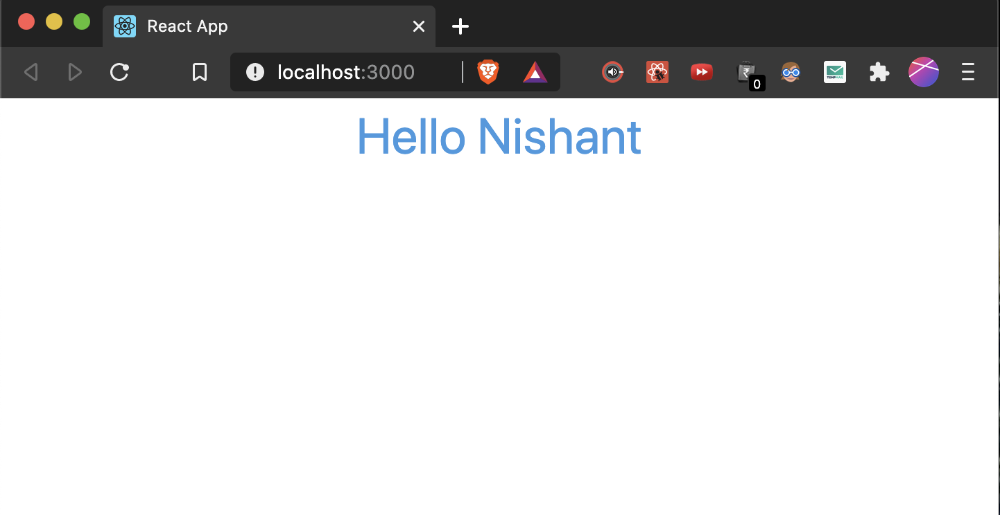

### What Is Tailwind CSS?
Tailwind is a utility-first CSS framework. In contrast to other CSS frameworks like Bootstrap or Materialize CSS it doesn’t come with predefined components. Instead Tailwind CSS operates on a lower level and provides you with a set of CSS helper classes. By using this classes you can rapidly create custom design with ease. Tailwind CSS is not opinionated and let’s you create you own unique design.


### Why Use Tailwind CSS?
* [Responsive to the core](https://tailwindcss.com/#responsive-to-the-core)
* [Component-friendly](https://tailwindcss.com/#component-friendly)
* [Designed to be customized](https://tailwindcss.com/#designed-to-be-customized)

### Getting Started with set up :-
To set up our project, we’ll scaffold a new React app using create-react-app. If you have already done this, skip this process, otherwise, run the command below:

```
npx create-react-app react-tailwindcss && cd react-tailwindcss
```

Next, we install a few development dependencies. You can use any of the options that work for you.

#### USING NPM
```
npm install tailwindcss postcss-cli autoprefixer@9.8.6 -D
```

#### USING YARN
```
yarn add tailwindcss postcss-cli autoprefixer@9.8.6 -D
```

We need to initialize Tailwind CSS by creating the default configurations. Type the command below in your terminal:
```
npx tailwind init tailwind.js --full
```
This command creates a tailwind.js in your project’s base directory, the file contains the configuration, such as our colors, themes, media queries, and so on. It’s a useful file that helps with predefined sets of properties which will aid the need to re-brand certain conventions or properties if the need arises.

#### Configure PostCSS in your project :-
>“PostCSS is a tool for transforming styles with JS plugins. These plugins can lint your CSS, support variables and mixins, transpile future CSS syntax, inline images, and more.”

Create a PostCSS configuration file in your base directory manually or using the command:
```
touch postcss.config.js
```
Add the following lines of code to your PostCSS file:
```
const tailwindcss = require('tailwindcss');
module.exports = {
    plugins: [
        tailwindcss('./tailwind.js'),
        require('autoprefixer')
    ],
};
```
Because PostCSS is necessary to lint our CSS, hence this configuration.

#### Now Inject Tailwind’s Components, Utilities And Base Styles To Your App

Inside your `src` folder create a folder, name it `assets`, this is where all your styles would be stored. In that folder, create a `tailwind.css` file and `main.css` file respectively. The tailwind.css file will be used by us to import Tailwind CSS styles, and for custom configurations and rules. The main.css will hold the styles that are generated as a result of what we have in the tailwind.css file.

Next, we need to import the base styles and configurations. We will do that in one of the CSS files we created above. Add the following to your tailwind.css file.

```
@tailwind base;

@tailwind components;

@tailwind utilities;
```

Tailwind CSS will swap these directives out at build time with all of its generated CSS. If you’re using postcss-import, use this instead:

```
@import "tailwindcss/base";

@import "tailwindcss/components";

@import "tailwindcss/utilities";
```

#### Now Configure Your App To Build Your CSS
Open your package.json file and use the snippet below in place of the script part of your package.json file:

If you are using npm:
```
"scripts": {
  "start": "npm run watch:css && react-scripts start",
  "build": "npm run watch:css && react-scripts build",
  "test": "react-scripts test",
  "eject": "react-scripts eject",
  "watch:css": "postcss src/assets/tailwind.css -o src/assets/main.css"
}
```
If you are using yarn:
```
"scripts": {
  "start": "yarn run watch:css && react-scripts start",
  "build": "yarn run watch:css && react-scripts build",
  "test": "react-scripts test",
  "eject": "react-scripts eject",
  "watch:css": "postcss src/assets/tailwind.css -o src/assets/main.css"
}
```
#### Now last step, we will import our CSS.

Open your index.js file and make the following changes:
* Import our main.css file and delete import './index.css';.

```
import './assets/main.css'
```

* Your *index.js* should look like this after the changes:

```
import React from "react";
import ReactDOM from "react-dom";
import './assets/main.css';
import App from "./App";
ReactDOM.render(<App />, document.getElementById("root"));
```

Next, we need to configure our project to build our CSS styles each time we run either the 
```
npm start 
or 
yarn start
```

Example with tailwind css:

App.js
```
import React from 'react';
function App() {
  return (
    <div className="flex flex-row justify-center">
      <p className="text-4xl text-blue-500">Hello Nishant</p>
    </div>
  );
}
export default App;
```

Output:


You can refer this [repo to see `tailwind`](https://github.com/nishant-ranjan28/react-practice) configuration and file structure.
