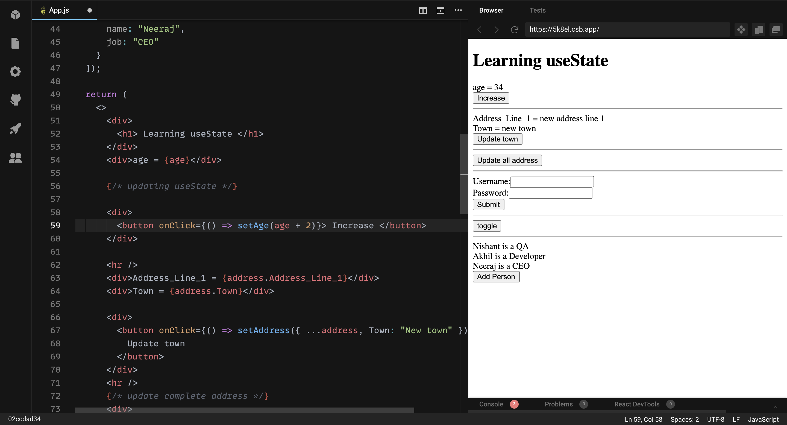
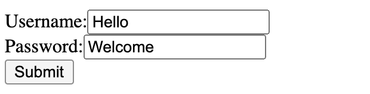
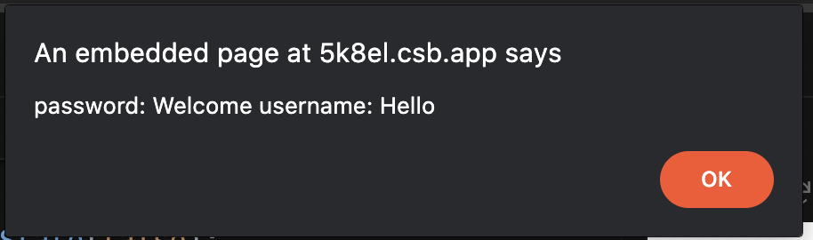
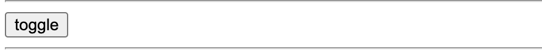
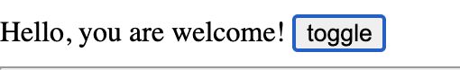
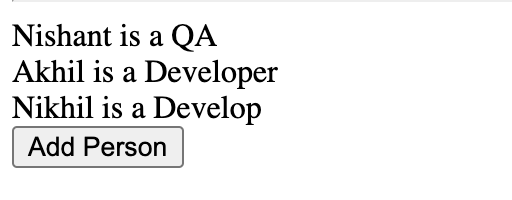
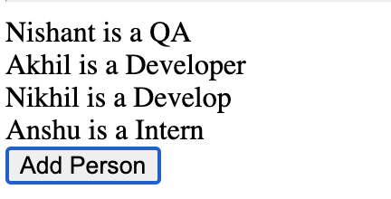

[As we know there are two types of components in React: class and functional components.](https://nishantranjan.in/Functional%20and%20Class%20components/)

#### Class components:

Class components are [ES6](https://developer.mozilla.org/en-US/docs/Web/JavaScript/Reference/Classes) classes that extend from [React.Component](https://reactjs.org/docs/react-component.html) and can have state and lifecycle methods:

```
class Message extends React.Component {
  constructor(props) {
    super(props);
    this.state = {
      message: ‘’    
    };
  }

  componentDidMount() {
    /* ... */
  }

  render() {
    return <div>{this.state.message}</div>;
  }
}
```

#### Functional components:

Functional components are functions that just accept arguments as the properties of the component and return valid JSX:

```
function Message(props) {
  return <div>{props.message}</div>
}
// Or as an arrow function
const Message = (props) =>  <div>{props.message}</div>
```
As you can see, there are no state or lifecycle methods.

> Since React Hooks have been released, function components can use state.

**In this post we will see and learn uses of useState hook with 3 examples. Let's start.** 

### Introducing useState()
The useState() function is a Hook that lets you add state to Function Components in React. Prior to this, only Class Components could use state.

How to import it into our code?
```
import React, { useState } from 'react';
```

### Using A State Variable and updating

We can use this hook to assign a state variable. Take an example, what if you want to update the age.

```
export default function App() {
  const [age, setAge] = useState(20);

  return (
    <>
    <div>age = {age}</div>

      {/* updating useState */}
      <div>
        <button onClick={() => setAge(age + 2)}> Increase </button>
      </div>
    </>
  );
}
```
### Multiple hooks/storing objects in a state

Here we are adding a new state to update the address.

```
export default function App() {
  const [address, setAddress] = useState({
    Address_Line_1: "address line 1",
    Town: "town",
    Pin: ""
  });
```

### Displaying properties from an object stored in the state

```
return (
    <>
      <div>Address_Line_1 = {address.Address_Line_1}</div>
      <div>Town = {address.Town}</div>
    </>
  );
}
```

### Updating an object stored in the state
Here as you can see, we are updating the address. (hard code) 

```
<div>
        <button onClick={() => setAddress({ ...address, Town: "New town" })}>
          Update town
        </button>
      </div>
```

### Updating multiple state variables at the same time
We will be using the same example as mentioned above. In the first state, we were updating age and in the other state, we were updating address. In this example, we will be updating both states at the same time. For this first, we will create a function to handle both state variables.

**updateAllAddress:**
In this function as you can see we are settling value for both states.
```
const updateAllAddress = () => {
    setAge(34);
    setAddress({
      Address_Line_1: "new address line 1",
      Town: "new town"
    });
  };
```
Now we will create a button and call the function.

```
      <div>
        <button onClick={updateAllAddress}>Update all address</button>
      </div>
```

### Rules of hooks
* [Rules of Hooks](https://reactjs.org/docs/hooks-rules.html)
* [Invalid Hook Call Warning](https://reactjs.org/warnings/invalid-hook-call-warning.html)


#### Example 1: Using Hook with form

```
export default function App() {

  //form username and password

  const [username, setUsername] = useState("");
  const [password, setPassword] = useState("");

  const handleFormSubmit = (event) => {
    alert(`password: ${password} username: ${username}`);
  };

  return(
    {/* submit form and alert */}
      <form onSubmit={handleFormSubmit}>
        Username:
        <input
          value={username}
          onChange={(event) => setUsername(event.target.value)}
        ></input>
        <div>
          Password:
          <input
            value={password}
            onChange={(event) => setPassword(event.target.value)}
          ></input>
        </div>
        <div>
          <button type="onSubmit">Submit</button>
        </div>
      </form>
  );
}

```

Output:




#### Example 2: conditional rendering (show text using toggle button)

```
export default function App(){
  // Conditional rendering
  const [showText, setShowText] = useState(false);

  return(
      {showText ? <span> Hello, you are welcome! </span> : null}
      <button onClick={() => setShowText(!showText)}> toggle </button>
  )
}
```

Output:



#### Example 3: rendering data from a list (i.e array)

```
export default function App(){
  //render list of people
  const [people, setPeople] = useState([
    {
      name: "Nishant",
      job: "QA"
    },
    {
      name: "Nikhil",
      job: "Developer"
    },
    {
      name: "Akhil",
      job: "Developer"
    }
  ]);

  return(
    {people.map((person) => (
        <div>
          {person.name} is a {person.job}
        </div>
      ))}
      <button
        onClick={() => setPeople([...people, { name: "Anshu", job: "Intern" }])}
      >
        Add Person
      </button>
  )
}
```

Output:



**[You find the source code here.](https://codesandbox.io/s/usestate-5k8el?file=/src/App.js)**

Thanks for reading.